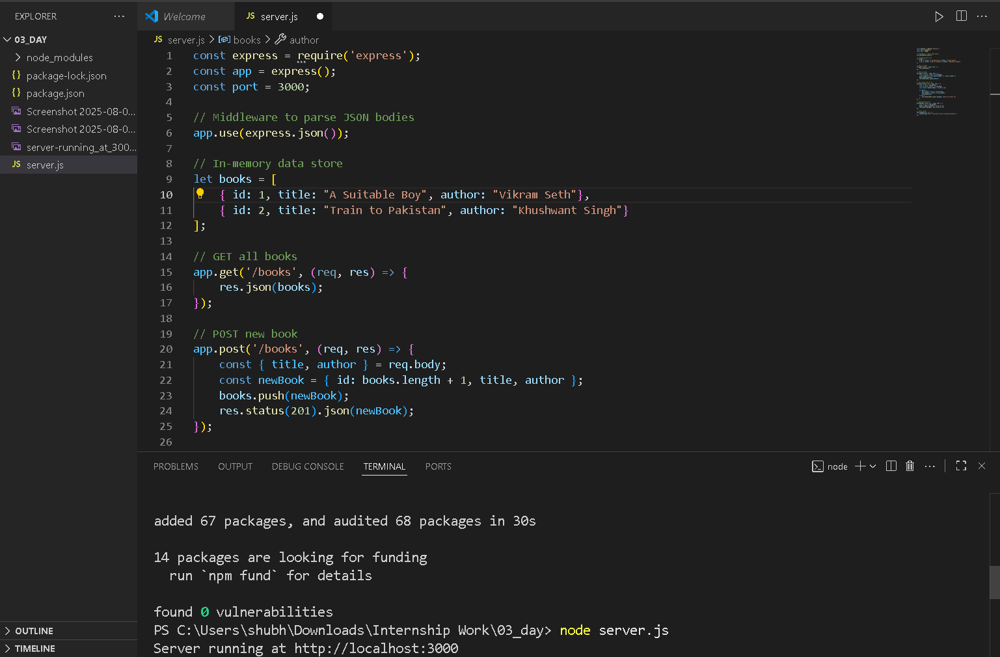
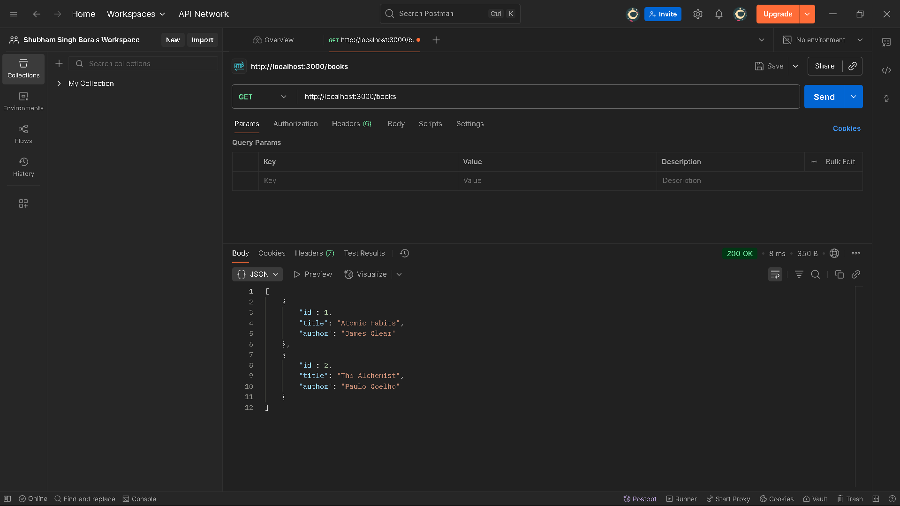
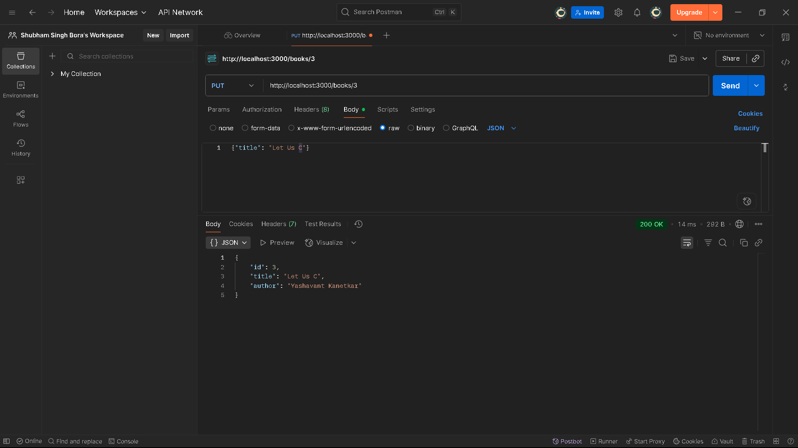
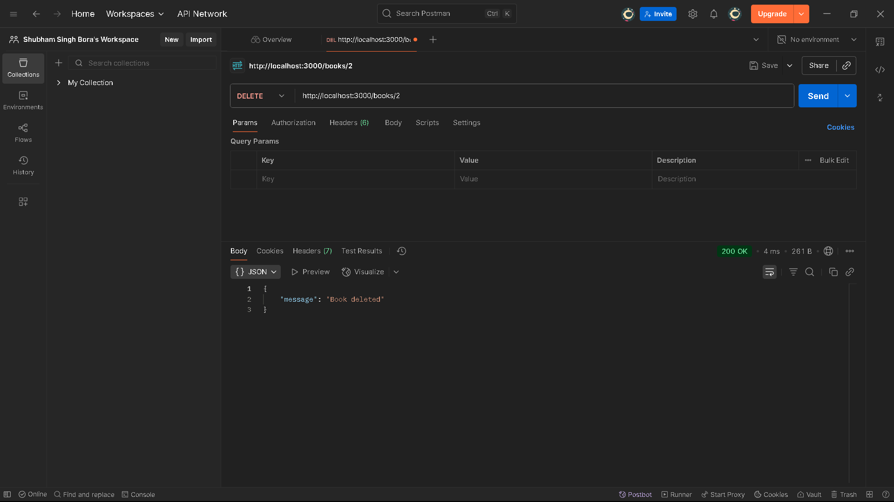

# 📚 Books REST API (Node.js + Express)

A simple REST API to manage a list of books, built with **Node.js** and **Express**.  
The API supports basic **CRUD** operations: Create, Read, Update, and Delete books.  
Data is stored **in-memory** (no database).

---

## 🚀 Features
- **GET** `/books` → Retrieve all books
- **POST** `/books` → Add a new book
- **PUT** `/books/:id` → Update an existing book by ID
- **DELETE** `/books/:id` → Delete a book by ID

---

## 📂 Project Structure
```
books-api/
├── node_modules/          # Dependencies
├── package.json           # Project metadata & scripts
├── package-lock.json      # Dependency lock file
├── server.js              # Express server & API routes
└── screenshots/           # API testing screenshots
```

---

## 🛠️ Installation & Setup

1️⃣ Clone the repository:
```bash
git clone https://github.com/your-username/books-api.git
cd books-api
```

2️⃣ Install dependencies:
```bash
npm install
```

3️⃣ Run the server:
```bash
node server.js
```
Server will start at: **http://localhost:3000**

(Optional) Use **nodemon** for auto-restart on file changes:
```bash
npm install --save-dev nodemon
npx nodemon server.js
```

---

## 📌 API Endpoints

### 1. GET all books
```http
GET /books
```
**Response Example:**
```json
[
  { "id": 1, "title": "A Suitable Boy", "author": "Vikram Seth"},
    { "id": 2, "title": "Train to Pakistan", "author": "Khushwant Singh"}
]
```

---

### 2. POST a new book
```http
POST /books
```
**Request Body:**
```json
{
  "title": "Let Us C",
  "author": "Yashavant Kanetkar"
}
```
**Response:**
```json
{
  "id": 3,
  "title": "Let Us C",
  "author": "Yashavant Kanetkar"
}
```

---

### 3. PUT (update) a book
```http
PUT /books/3
```
**Request Body:**
```json
{
  "title": "Let Us C"
}
```
**Response:**
```json
{ "id": 2, "title": "Let Us C", "author": "Yashavant Kanetkar" }
```

---

### 4. DELETE a book
```http
DELETE /books/2
```
**Response:**
```json
{ "message": "Book deleted" }
```

---

## 🖼️ Screenshots

### 1. Running the Server


### 2. GET /books


### 3. POST /books


### 4. PUT /books/:id


### 5. DELETE /books/:id


---

## 🧪 Testing with Postman
1. Open Postman.
2. Send requests to **http://localhost:3000**.
3. For POST & PUT, set **Body → raw → JSON** and enter the request body.
4. View responses and verify functionality.

---


💡 **Note:** This project can be extended by connecting to a real database like **MongoDB** or **MySQL** for persistent storage.
